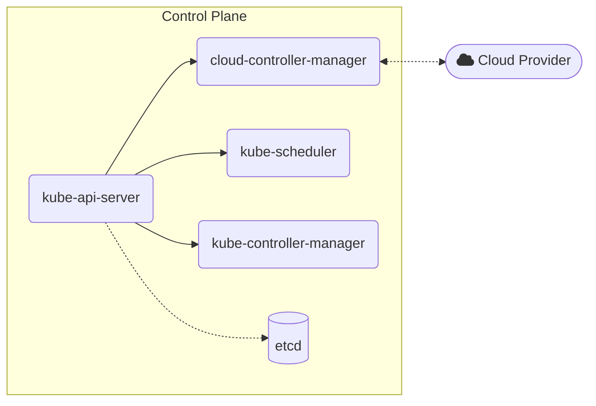

# Kubernetes: Basic

## What is Kubernetes (K8s)?

[https://kubernetes.io/docs/concepts/overview/]

Kubernetes is a portable, extensible, open source platform for managing containerized workloads and services, that facilitates both declarative configuration and automation. It has a large, rapidly growing ecosystem. Kubernetes services, support, and tools are widely available.

The name Kubernetes originates from Greek, meaning helmsman or pilot. K8s as an abbreviation results from counting the eight letters between the "K" and the "s". 

## Why use Kubernetes? What problem is it trying to solve?

[https://kubernetes.io/docs/concepts/overview/]

Applications deployment evolved over the years:

- **Traditional Deployment**: Multiple applications can run on a physical server. However, this is very expensive for organisations to maintain. Servers can also be wasteful if the resources are underutilised.
- **Virtualised Deployment**: Applications are deployed inside virtual machines (VM) on a physical machine. VMs allow applications to be isolated. However, VMs have high overhead, as each VM needs to run all the components, including its own operating system (OS) on top of virtualised hardware. Applications deployment in VM is also highly dependant on the choice of OS and its availability.
- **Container Deployment**: Containers are similar VMs but they have relaxed isolation properties to share the OS between the applications. As they are decoupled from the underlying infrastructure, they are portable across clouds and OS distributions.

Containers are a good way to bundle and run your applications. In a production environment, you need to manage the containers that run the applications and ensure that there is no downtime. For example, if a container goes down, another container needs to start. Wouldn't it be easier if this behavior was handled by a system?

Kubernetes is an enhancement framework built on top of **Container Deployment** model. It takes care of scaling and failover for your application, provides deployment patterns, and more.

Kubernetes provides you with:

- **Service discovery and load balancing:** Kubernetes can expose a container using the DNS name, allowing other containers to find the location of new container. If traffic to a container is high, Kubernetes is able to load balance and distribute the network traffic so that the deployment is stable.
- **Storage orchestration:** Kubernetes allows you to automatically mount a storage system of your choice, such as local storages, public cloud providers, and more.
- **Automated rollouts and rollbacks:** You can describe the desired state for your deployed containers using Kubernetes, and it can change the actual state to the desired state at a controlled rate. For example, you can automate Kubernetes to create new containers for your deployment, remove existing containers and adopt all their resources to the new container.
- **Automatic bin packing:** You provide Kubernetes with a cluster of nodes that it can use to run containerized tasks. You tell Kubernetes how much CPU and memory (RAM) each container needs. Kubernetes can fit containers onto your nodes to make the best use of your resources.
- **Self-healing:** Kubernetes restarts containers that fail, replaces containers, kills containers that don't respond to your user-defined health check, and doesn't advertise them to clients until they are ready to serve.
- **Secret and configuration management:** Kubernetes lets you store and manage sensitive information, such as passwords, OAuth tokens, and SSH keys. You can deploy and update secrets and application configuration without rebuilding your container images, and without exposing secrets in your stack configuration.

## Kubernetes Components

[https://kubernetes.io/docs/concepts/overview/components/]

A Kubernetes cluster consists:
- The **control plane**: collection of multiple components responsible for managing the cluster itself. Control planes are usually run on dedicated _controller_ machine.
- One or more **nodes**: machines where containers managed by the cluster run.

## Control Plane Components

A Kubernetes Control Plane consists of the following components:

